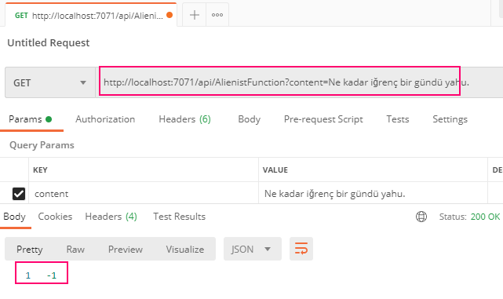

# .Net 4.7.2 Tabanlı bir Uygulamalar Bütününü Net 5'e Nasıl Taşırız?

Malum Net 5, .Net Framework dönemlerinden gelen bazı konuları artık içermiyor/desteklemiyor. WPF, WCF, WWF, .Net Remoting buna örnek olarak verilebilir.Herhalde 2020ler Net 5'in yılları olacak. Bu noktada 2000lerden gelen ve evrilerek .Net 4.8'e kadar çıkan birçok uygulama olduğunu da ifade etsek yeridir. Dolayısıyla bu çözümleri Net 5'e taşımak isteyebiliriz. Bu pratikte .Net 4.7.2 tabanlı bir solution içeriğini Net 5'e taşımakla ilgili çalışmalar yer alacak. 

İki klasörümüz var. Birisi var olan uygulamamız diğeri de Net 5'e çevrilmiş hali.

## ClassicGames

.Net Framework 4.7.2'yi merkezine alan Solution. _(Özellikle projelerin packages.config, csproj dosya içeriklerini takip edin)_

- ClassicGames.Models: Model sınıfları olan Game ve GameReview tiplerini içerip, Newtonsoft'u referans eden Class Library türevidir.
- ClassicGames.DAL: Data Access Layer rolünü üstlenen Class Library. Autofac _(IoC Container için)_, Serilog _(Loglama için)_ ve EntityFramework _(ORM entegrasyonu için)_ NuGet paketlerinin .Net Framework 4.7.2 için uyumlu olan sürümlerini kullanıyor. Oyun ve oyun yorumları ile ilgili gerekli CRUD operasyonlarını sağlayan bir kütüphane.
- ClassicGames.WebClient: Asp.Net MVC 5 tipinden bir web istemcisidir. Repository üstünden oyun ve oyun yorumları ile ilgili operasyonları icra eder. Bunun için ClassicGames.DAL ve ClassicGames.Models projelerini kullanır. Ayrıca, Antlr, Autoface, EntityFramework, Bootstrap gibi Nuget paketleri kullanmaktadır.
- ClassicGames.Dashboard: WPF tabanlı bir Administrator uygulamasıdır. Yeni bir oyun eklemek, silmek, bilgilerini güncellemek için kullanılan basit bir windows uygulaması olarak düşünülebilir. GamesWindow.xaml üstündeki DataGrid oldukça yeteneklidir. Tuşa hassasiyeti vardır. Del ile kayıt silebilir, çift tıkladığımız hücrelerde anında güncelleme yapabiliriz. Autofac, Entity Framework, Newtonsoft.Json, Serilog nuget paketlerini kullanıyor.

MVC 5 tabanlı web uygulamasına ait birkaç ekran görüntüsü...

Bizi karşılayan boş bir lobi sayfası.


Commdore64DBInitializer sınıfı ile ilk etapta eklenen iki oyun bilgisinin gösterildiğin oyunlar sayfası.


Bir oyun için detaya gittiğimizde karşımıza çıkmasını beklediğimiz sayfa.


Oyunla ilgili değerlendirmelerin toplu olarak görüldüğü sayfa.


Bir değerlendirmeyi silmek istediğimizde karşımıza çıkan sevimli sayfa :P


WPF Olarak Tasarlanmış Dashboard uygulamasına ait birkaç ekran görüntüsü.

Ana sayfanın iğrenç grid görüntüsü :D


Efsane futbol oyununu ekleyip sonrasında kapak fotoğrafını güncellerken...


ve bu da bir oyunun JSON çıktısının alınmış hali.


Silme operasyonunda da böyle bir durum oluşuyor.


## Migration İşlemleri

En basiti olan ClassicGames.Models ile işe başlanabilir. Sadece packages.config ve csproj değişiklikleri yeterli olur.

### packages.config Migrations

Net 5 tarafındaki paket yönetim tarafı farklıdır. packages.config içeriği csproj içerisinde yer alır. Visual Studio bu noktada bize kolaylık sağlar.
packages.config dosyasına sağ tıklayınca çıkan _Migrate packages.config to Package Reference_ ile bu işlem kolayca yapılabilir. Tabii ilgili içeriği elle de taşıyabiliriz.
İlk olarak ClassicGames.Models projesi için bu işlemi yapalım. İlgili seçim sonrası çıkan pencerede bağımlılıkları görebiliriz.


Migration başarılı bir şekilde tamamlanınca bir rapor da üretilir.


ve bu rapor fiziki olarak klasör içerisine de alınır. Dolayısıyla ortam değişikliği fiziki hafızaya kaydeder. Gerekirse geri alabilelim diye.


Migration sonrası projeyi build etmemiz gerekir. csproj'da meydana gelen değişiklik aşağıdaki gibidir.


_packages.config -> Package Reference düzenlemeleri kullanılan diğer projeler için de uygulanmalıdır_

### csproj düzenlemesi

Net 5'in csproj dosya içeriği insanlar için daha okunabilir bir hale getirilmiştir. Var olan csproj dosyaları bu açıdan yeniden düzenlenir. 
Bu işlem için ilk olarak ilgili proje _Unload Project_ seçeneği ile kaldırılır ve sonrasında csproj dosyası _Edit Project File_ seçeneği ile yeniden düzenlenir.
Var olan AssemblyInfo.cs dosyasına da ihtiyaç yoktur, silinebilir. csproj'un güncel hali aşağıdaki gibidir.

```xml
<Project Sdk="Microsoft.NET.Sdk">	
	<PropertyGroup>
		<TargetFramework>net5.0</TargetFramework>
	</PropertyGroup>	
	<ItemGroup>
		<PackageReference Include="Newtonsoft.Json">
			<Version>12.0.2</Version>
		</PackageReference>
	</ItemGroup>	
	<ItemGroup>
		<Folder Include="Properties\"/>
	</ItemGroup>	
</Project>
```

### ClassicGames.DAL için Dönüşümler

Data Access Layer için kullanılan bu proje ORM tarafı için Entity Framework ve Dependency Injection yönetimi için Autofac kullanmaktadır. Bunların da Net 5 için güncellenmesi gerekir.
Entity Framework için Core sürümü tercih edilir ve bu kod tarafında da değişiklik yapılmasını gerektirir. Autofac yerine ise .Net Core ile birlikte hayatımıza gire dahili injection kütüphanesi kullanılabilir.
packages.config dönüşümü bize proje bağımlılıklarını da gösterir.


Models projesinde olduğu gibi csproj için de düzenleme yapılır._(Unload Project->Edit Project File->Edit->Reload Project->Build)_

```xml
<Project Sdk="Microsoft.NET.Sdk">
	<PropertyGroup>
		<TargetFramework>net5.0</TargetFramework>
	</PropertyGroup>
	<ItemGroup>
		<ProjectReference Include="..\ClassicGames.Models\ClassicGames.Models.csproj">
			<Name>ClassicGames.Models</Name>
		</ProjectReference>
	</ItemGroup>
	<ItemGroup>
		<EmbeddedResource Include="Assets\paper_boy.png" />
		<EmbeddedResource Include="Assets\the_last_ninja.jpg" />
	</ItemGroup>
	<ItemGroup>
		<PackageReference Include="Microsoft.EntityFrameworkCore.SqlServer" Version="5.0.4" />
		<PackageReference Include="Microsoft.Extensions.DependencyInjection" Version="5.0.1" />
		<PackageReference Include="Serilog" Version="2.10.0" />
	</ItemGroup>
</Project>
```

Bu aşamada build EF Core farklılıkları ve Autofac olmadığından dolayı hatalar verecektir. Yapılan düzenlemeler şöyle özetlenebilir.

- CommodoreDBContext sınıfı tekrardan düzenlenir ve CommodoreDBInitilaizer içindeki Seed operasyonu buraya alınır. Niteki Core tarafında örnek veri oluşturma prosedürü değişmiştir. HasData metodu kullanılır. CommodoreDBInitilaizer silinir.
- GameRepository sınıfı yeni DbContext ile uyumlu hale getirilir. _(using kullanımlarına dikkat)_
- DI Framework için kullanılan Autofac kaldırıldığı için ClassicGamesDBModule Microsoft.Extensions.DependencyInjection ile çalışacak hale getirilir.

### WPF Tarafının Taşınması

WPF halen Net 5 tarafında destekleniyor. Bu nedenle çok acı bir durumda değiliz. İlk olarak packages.config birleştirme işlemini yapmak, AssemblyInfo.cs'ten kurtulmak ve csproj dosyasını uyumlu hale getirmek gerekiyor. Önceki adımlardakine benzer şekilde hareket edilebilir.
Konfigurasyon yönetimi artık appsettings.json üzerinden yapıldığı için içerisinde connectionString bilgisini barındıran bir tanesini de eklememiz lazım.


```xml
<Project Sdk="Microsoft.NET.Sdk">
	<PropertyGroup>
		<TargetFramework>net5.0-windows</TargetFramework>
		<OutputType>WinExe</OutputType>
		<UseWPF>true</UseWPF>
	</PropertyGroup>
	<ItemGroup>
		<ProjectReference Include="..\ClassicGames.DAL\ClassicGames.DAL.csproj">
			<Name>ClassicGames.DAL</Name>
		</ProjectReference>
		<ProjectReference Include="..\ClassicGames.Models\ClassicGames.Models.csproj">
			<Name>ClassicGames.Models</Name>
		</ProjectReference>
	</ItemGroup>
	<ItemGroup>
		<PackageReference Include="Microsoft.Extensions.DependencyInjection" Version="5.0.1" />
		<PackageReference Include="Microsoft.Extensions.Configuration.FileExtensions" Version="5.0.0" />
		<PackageReference Include="Microsoft.Extensions.Configuration.Json" Version="5.0.0" />
		<PackageReference Include="Newtonsoft.Json" Version="13.0.1" />
		<PackageReference Include="Serilog" Version="2.10.0" />
	</ItemGroup>
	<ItemGroup>
		<None Update="appsettings.json">
			<CopyToOutputDirectory>PreserveNewest</CopyToOutputDirectory>
		</None>
	</ItemGroup>
</Project>
```

Bu işlemlerden sonra Autfac ve EF değişimleri nedeni ile derleme hatası alan App.xaml.cs içeriğini uyumlu hale getirmek gerekiyor.

### Web Uygulamasının Taşınması

MVC WebClient uygulamasının .Net 5.0 platformuna evrilmesinin en iyi yolu sıfırdan bir web projesi açıp diğerinden Controller ve View gibi enstrümanları taşımak gibi görünüyor. Bu nedenle önce Solution'daki var olan proje çıkartıldı._(Önceki sürümün yedeğini almıştık zaten)_ .Net 5.0 destekli yeni bir Asp.Net Core Web Application oluşturuldu. Bu yeni projede yapılanları ise şöyle.

- Eski projedeki _global.asax_ artık yok. Gerekli Depedency Injection entegrasyonu _Startup.cs_ üstünden yapılır.
- _appSettings.json_ dosyasına CommodoreDB bağlantısı için gerekli _ConnectionStrings_ bilgisi eklenir.
- Eski projedeki Controller sınıfları bu projeye de kopyalanır ve MVC 5.0 uyumluluğu için aşağıdaki değişiklikler yapılır.
  - _System.Web.Mvc_ isimalanı _Microsoft.AspNetCore.Mvc_ ile değiştirilir.
  - _HttpStatusCodeResult(HttpStatusCode.BadRequest)_ yerine _BadRequestResult_ kullanılır.
  - _HttpNotFound_ tipi yerine _NotFound_ kullanılır.
  - _Bind_ niteliğine ait _Include_ özelliği kaldırılır.
- View klasöründeki içerik buraya da taşınır ama bazı değişikliker yapılır.
  - _@section Scripts{_ kısımları kaldırılır.
  - _@Html.HiddenFor_'un GameReviews altındaki view'lardaki bazı kullanımları, _Hidden_ fonksiyonu ile değiştirilir.
  - _Layout.cshtml_ sayfasındaki _@Scripts_ ve _@Styles_ direktifleri desteklenmediği için yerlerine _script src_ ve _link_ direktifleri kullanılır.

Bu değişikliklerden sonra WPF ve Web tarafındaki uygulamaların test edilmesi önerilir. Çalışıyorlarsa süper :)

# Veritabanının Azure'a Alınması

Sıradaki adımımız SQL veritabanını Azure üzerinden kullanmak. Kişisel Azure hesabımızla bir deneme yapabiliriz. Öncelikle [https://shell.azure.com](https://shell.azure.com) adresine gidilir Bash tipli terminal açılır. Aşağıdaki terminal komutları ile Azure SQL Database oluşturulur.

```bash
# İlk iş bir veri merkezini(data center) kullanan resourceGroup oluşturmak
# Önce aşağıdaki gibi resourceGroupName ve location isimli değişkenleri tanımlayalım.
rgName=cgAppResourceGroup
# Bir azure data center seçmemiz gerekiyor. Güncel data center listesini aşağıdaki komutla çekebiliriz
az account list-locations -o table
# Ben germanywestcentral'ı seçtim
location=germanywestcentral
# Artık bu iki değişkeni kullanarak resource group'u oluşturabiliriz.
# shell.Azure'da olduğumuz için Azure CLI aracı olan 'az' den yararlanacağız
az group create --name $rgName --location $location
```

Buna göre aşağıdakine benzer bir sonuç elde etmeliyiz.,


```bash
# SQL Server için username, password ve sunucu adı bilgilerini de bir değişken olarak tanımlayalım
username=scotie
password=t1ger_tanks
serverName=burakselimSQLServer

# Şimdi bu parametreleri kullanarak SQL sunucusunu oluşturalım
az sql server create --name $serverName --resource-group $rgName --location $location --admin-user $username --admin-password $password
```

Eğer bir sorun çıkmazsa Azure SQL Server başarılı şekilde oluşur.


Sırada firewall için whitelist ayarlamaları var. Kendi IP adresimizi Azure tarafına ekletmemiz lazım. Çalıştığımız bilgisayar IP adresini [https://whatismyipaddress.com](https://whatismyipaddress.com) sitesinden öğrenebiliriz.

```bash
# ip değişkenlerimiz
startipAddress=[ip adresiniz]
endipAddress=[ip adresiniz]

# Whitelist'e local IP mizi kaydetmek için aşağıdaki komutla ilerleyelim.
az sql server firewall-rule create --resource-group $rgName --server $serverName -n DeveloperLocalIP --start-ip-address $startipAddress --end-ip-address $endipAddress

# Bu da Azure servisleri için whitelist ayarı
az sql server firewall-rule create --resource-group $rgName --server $serverName -n AzureServices --start-ip-address 0.0.0.0 --end-ip-address 0.0.0.0
# Bu arada sunucu adındaki büyük harf kullanımı sorun çıkartabilir ki bende çıkarttı. Bu durumda sunucu adını Azure'un verdiği gibi küçük harfli olarak kullanmak gerekir.
serverName=burakselimSQLServer
```


```bash
# Artık sunucu ve firewall izinleri hazır
# Veritabanı oluşturulabilir
az sql db create --resource-group $rgName --server $serverName --name CommodoreDB --service-objective Basic
```

Veritabanını başarılı şekilde oluşup oluşmadığını Azure portal'den görebiliriz.


## Local'den Azure'a Data Migration

Veritabanını oluşturduktan sonra local'deki veritabanı şemasını ve içeriğini taşıyabiliriz de. Bunun için [Microsoft Data Migration Assistant](https://www.microsoft.com/en-us/download/details.aspx?id=53595) aracından yararlanılabilir.
Ancak Dashboard uygulaması üstünden Migration planı çalıştırıp Azure üzerinde veritabanı tablolarının oluşturulmasını ve ilk kayıtların eklenmesini de sağlayabiliriz. Bunun için Dashboard ve WebClient uygulamalarınının appSettings.json dosyalarındaki bağlantı bilgilerini Azure SQL veritabanını işaret edecek şekilde değiştirmemiz yeterlidir.

Bizim örneğimiz için aşağıdaki gibi.

```text
Server=tcp:burakselimsqlserver.database.windows.net,1433;Database=CommodoreDB;User ID=scotie;Password=t1ger_tanks;Encrypt=true;Connection Timeout=30
```

İlk olarak Dashboard uygulamasını çalıştırırsak _(ki bizim Admin arayüzümüzdür)_ Migration planı çalışır ve şema ile verile oluşur. _(Elbette önceki denemelerde yerel veritabanına daha fazla veri eklenmişse Microsoft Data Migration Assistant veya benzeri bir aracı kullanmak daha doğru olacaktır)_ 
Sonrasında WebClient'ı çalıştırıp uygulamanın fonksiyonelliklerini test edebiliriz.


## Web Uygulamasının Azure App Service olarak Taşınması

Bu adımda ClassicGamesAzure solution'ı içerisindeki WebClient'ı, Azure tarafına taşıyacağız. Yine Azure Shell'i kullanabiliriz.

```bash
# ilk olarak bir Azure Service Plan oluşturalım.
# Azure Service Plan bir veya daha çok web uygulamasını barındırabilir ve bunların tamamı aynı fiziksel kaynakları kullanır.
# Örneğimiz için Free Tier planının (F1) kullanabiliriz.

# Gerekli değişkenler
planName=cgServicePlan
appName=buraksc64world

# Plan oluşturluyor
az appservice plan create --name $planName --resource-group $rgName --sku F1

# Web uygulaması oluşturuluyor
az webapp create --resource-group $rgName --plan $planName --name $appName

# Örneğimiz .Net 5 çalışma zamanını gerektiriyor. Kullanılabilecek runtime listesine bir bakalım.
az webapp list-runtimes
# Kuvvetle muhtemel .Net 5 çalışma zamanı orada olacaktır. Devam edebiliriz.
```

Azure tarafında web uygulaması için bir plan, bir uygulama ve çalışma zamanını oluşturduk. Peki makinedeki uygulamayı buraya nasıl publish edeceğiz. Visual Studio'un Publish Profile özelliğini bu anlamda işimizi epeyce kolaylaştıracaktır.

Bunu iki şekilde yapabiliriz. Azure Portal üstündeki Get publish Profile seçeneğiyle

ya da komut satırından _(Azure Shell)_ aşağıdaki şekilde.


```bash
az webapp deployment list-publishing-profiles --name $appName --resource-group $rgName --xml --output tsv
```

Profile dosyasını tahmin edileceği üzere projenin publish stratejisini belirlemek için kullanacağız. Bunun için ClassicGames.WebClient projesine sağ tıklayıp Publish seçeneğini kullanarak süreci başlatmalıyız.


Sonuçta aşağıdakine benzer bir çıktık ile karşılaşmalıyız.


Sonrasında tek yapmamız gereken _Publish_ düğmesine basmak. Paket hazırlanıp, profile bilgilerine göre Azure tarafına deploy edilecektir.


Ardından Azure tarafındaki web uygulamasına giderek sistemin çalışıp çalışmadığını görebiliriz.


___Hatırlatmakta yarar var. Bir ihtimal veritabanını Azure tarafına migrate ettikten sonra bilgisayarı kapatmış olabilirsiniz. IP'niz statik değilse internete tekrar bağlandığınızda değişecektir. Bu durumda Firewall tarafındaki whitelist'e local IP nizi tekrar eklemeniz gerekir. local makineden Azure tarafına gidebilmek için bir tane ve Azure'daki App Service uygulamasından yine oradaki veritabanına ulaşmak için de bir tane olmak üzere toplamda iki işlem. Yukarıda bunları yapmıştık ;)___

# Uygulamaya Azure Function Eklenmesi

Kitap gerçekten çok güzel örnekler içeriyor. Başlangıçta .Net Framework 4.7.2 sürümünde olan çözüm içindeki uygulamaları .Net 5 uyumlu hale getirdikten sonra, veritabanı ve web tarafını Azure üzerine de almayı öğretti. Sıradaki adım ise HTTP ile tetiklenebilen bir Azure Function geliştirip bunu Web uygulamasından kullandırmak. Serverless olarak anlam bulan bu Azure Function'ın kitaptaki görevi yorumların duygu analizini simüle etmek. Anladığım kadarıyla hedefimiz yeni bir yorum eklendiğinde tetiklenecek Azure fonksiyon ile bu yorumun pozitif olup olmadığını tespit etmek. Benzer şekilde ilerleyeceğim.

Azure Function'ı geliştirmek için bu kez Azure Functions Core Tools'u kullanmaya karar verdim. [Şu adrese uğrayarak](https://docs.microsoft.com/en-us/azure/azure-functions/functions-run-local?tabs=windows%2Ccsharp%2Cbash#install-the-azure-functions-core-tools) Windows 10 için olan kurulumunu yaptım.

```bash
cd ClassicGamesAzure
# Azure Function Projesinin oluşturulması
func init Analysis --dotnet

# Projenin, solution'a eklenmesi
dotnet sln add .\Analysis\

# HTTP ile tetiklenecek fonksiyonun eklenmesi
cd Analysis
func new --name AlienistFunction --template "HTTP trigger" --authlevel "anonymous"

# Eğer istersek şu noktada fonkisyonun ilk halini, localde çalışacak şekilde test edebiliriz
func start
```


Tabii bu Hello World modeli. Şimdi neler yaptığımıza bakalım.

- Duygu durum analizi yapan servisi ekledik _(IAlienistService sözleşmesi, uygulayan AlienistService sınıfı ve duygu durumunu belirten Report isimli Enum sabiti)_
- Yukarıdaki servisi DI ile almak için projeye Microsoft.Azure.Functions.Extensions nuget paketini ekledik.
  - ___dotnet add package Microsoft.Azure.Functions.Extensions___
- DI mekanizmasını fonksiyon başlatılırken kullanmamız gerekiyor. Bu nedenle FunctionStartup türevli bir Startup sınıfı ekleniyor. _(FunctionsStartup nitelik kullanımı ve sınıf türetmesine dikkat edin. Birde DI uygulanışına tabii)_
- AlienistFunction içerisindeki Run fonksiyonunu da, AlienistService'i kullanacak şekilde değiştirdik.

## Local Testler

Şu anda servisi local ortamda çalıştırıp hem url üstünden hem de Postman gibi bir araçla JSON içeriği göndererekten test edebiliriz. Uygulamayı komut satırından _func start_ ile çalıştırabileceğimiz gibi, Visual Studio ile de başlatabiliriz. Visual Studio ile çalıştırma seçilirse ilk seferde sistemde yoksa Azure Emulator ve gerekli SDK lar indirilir. Bu da biraz zaman alabilir. Lakin Visual Studio üstünden uygulamayı Debug etmek ve kodun işleyişini görmek de oldukça keyifli.

```text
# url testi için HTTP Get ile şunları deneyebiliriz
http://localhost:7071/api/AlienistFunction?content=Bugün güzel, nefis bir gün.
http://localhost:7071/api/AlienistFunction?content=Ne kadar iğrenç bir gündü yahu.
```

Bu iki çağrı için aşağıdaki sonuçları elde etmeliyiz.




Postman'den HTTP Post ile JSON içeriğini aşağıdaki gibi Body üstünden göndererek de ilerleyebiliriz. Yani hem HTTP Get ile hem de HTTP Post ile Azure fonksiyonumuzu tetiklememiz mümkün.

```json
{
    "commentText": "Bugün çok güzel bir gün öyle değil mi? Dün çok kötü geçmişti ama bugün her şey yoluna girdi. Kendimi olağanüstü iyi hissediyorum."
}
```


## Azure Function için Deploy İşlemleri

_YAPILACAK_

## Azure Function Uygulamasının Web Uygulamasına Entegre Edilmesi

_YAPILACAK_

# Azure Kaynaklarını Silmek İçin

Her ne kadar deneysel bir çalışma olsa da kaynakları temizlemekte yarar var. Bunun için Azure Shell üstünden aşağıdaki komutları çalıştırmak yeterli olacaktır.

```bash
rgName=cgAppResourceGroup
az group delete --name $rgName
```

[Kaynak](https://www.packtpub.com/product/adopting-net-5/9781800560567)