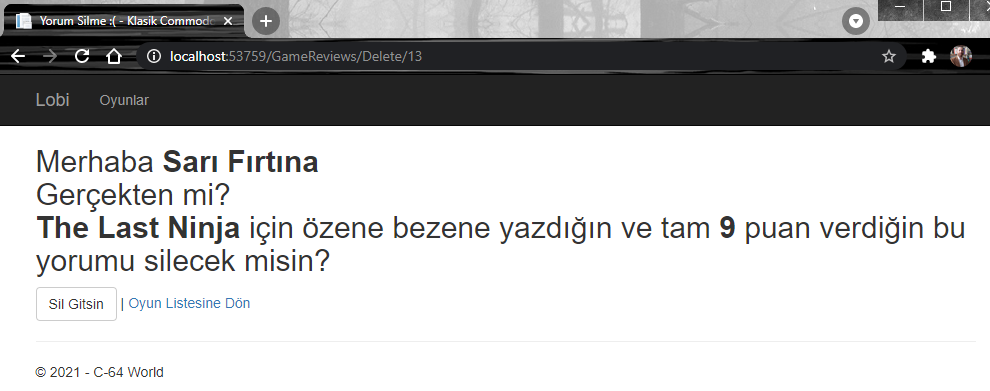

# .Net 4.7.2 Tabanlı bir Uygulamalar Bütününü Net 5'e Nasıl Taşırız?

Malum Net 5, .Net Framework dönemlerinden gelen bazı konuları artık içermiyor/desteklemiyor. WPF, WCF, WWF, .Net Remoting buna örnek olarak verilebilir.Herhalde 2020ler Net 5'in yılları olacak. Bu noktada 2000lerden gelen ve evrilerek .Net 4.8'e kadar çıkan birçok uygulama olduğunu da ifade etsek yeridir. Dolayısıyla bu çözümleri Net 5'e taşımak isteyebiliriz. Bu pratikte .Net 4.7.2 tabanlı bir solution içeriğini Net 5'e taşımakla ilgili çalışmalar yer alacak. 

İki klasörümüz var. Birisi var olan uygulamamız diğeri de Net 5'e çevrilmiş hali.

## ClassicGames

.Net Framework 4.7.2'yi merkezine alan Solution. _(Özellikle projelerin packages.config, csproj dosya içeriklerini takip edin)_

- ClassicGames.Models: Model sınıfları olan Game ve GameReview tiplerini içerip, Newtonsoft'u referans eden Class Library türevidir.
- ClassicGames.DAL: Data Access Layer rolünü üstlenen Class Library. Autofac _(IoC Container için)_, Serilog _(Loglama için)_ ve EntityFramework _(ORM entegrasyonu için)_ NuGet paketlerinin .Net Framework 4.7.2 için uyumlu olan sürümlerini kullanıyor. Oyun ve oyun yorumları ile ilgili gerekli CRUD operasyonlarını sağlayan bir kütüphane.
- ClassicGames.WebClient: Asp.Net MVC 5 tipinden bir web istemcisidir. Repository üstünden oyun ve oyun yorumları ile ilgili operasyonları icra eder. Bunun için ClassicGames.DAL ve ClassicGames.Models projelerini kullanır. Ayrıca, Antlr, Autoface, EntityFramework, Bootstrap gibi Nuget paketleri kullanmaktadır.
- ClassicGames.Dashboard: WPF tabanlı bir Administrator uygulamasıdır. Yeni bir oyun eklemek, silmek, bilgilerini güncellemek için kullanılan basit bir windows uygulaması olarak düşünülebilir. GamesWindow.xaml üstündeki DataGrid oldukça yeteneklidir. Tuşa hassasiyeti vardır. Del ile kayıt silebilir, çift tıkladığımız hücrelerde anında güncelleme yapabiliriz. Autofac, Entity Framework, Newtonsoft.Json, Serilog nuget paketlerini kullanıyor.

MVC 5 tabanlı web uygulamasına ait birkaç ekran görüntüsü...

Bizi karşılayan boş bir lobi sayfası.


Commdore64DBInitializer sınıfı ile ilk etapta eklenen iki oyun bilgisinin gösterildiğin oyunlar sayfası.


Bir oyun için detaya gittiğimizde karşımıza çıkmasını beklediğimiz sayfa.


Oyunla ilgili değerlendirmelerin toplu olarak görüldüğü sayfa.


Bir değerlendirmeyi silmek istediğimizde karşımıza çıkan sevimli sayfa :P


WPF Olarak Tasarlanmış Dashboard uygulamasına ait birkaç ekran görüntüsü.

Ana sayfanın iğrenç grid görüntüsü :D


Efsane futbol oyununu ekleyip sonrasında kapak fotoğrafını güncellerken...


ve bu da bir oyunun JSON çıktısının alınmış hali.


Silme operasyonunda da böyle bir durum oluşuyor.


## Migration İşlemleri

En basiti olan ClassicGames.Models ile işe başlanabilir. Sadece packages.config ve csproj değişiklikleri yeterli olur.

### packages.config Migrations

Net 5 tarafındaki paket yönetim tarafı farklıdır. packages.config içeriği csproj içerisinde yer alır. Visual Studio bu noktada bize kolaylık sağlar.
packages.config dosyasına sağ tıklayınca çıkan _Migrate packages.config to Package Reference_ ile bu işlem kolayca yapılabilir. Tabii ilgili içeriği elle de taşıyabiliriz.
İlk olarak ClassicGames.Models projesi için bu işlemi yapalım. İlgili seçim sonrası çıkan pencerede bağımlılıkları görebiliriz.


Migration başarılı bir şekilde tamamlanınca bir rapor da üretilir.


ve bu rapor fiziki olarak klasör içerisine de alınır. Dolayısıyla ortam değişikliği fiziki hafızaya kaydeder. Gerekirse geri alabilelim diye.


Migration sonrası projeyi build etmemiz gerekir. csproj'da meydana gelen değişiklik aşağıdaki gibidir.


_packages.config -> Package Reference düzenlemeleri kullanılan diğer projeler için de uygulanmalıdır_

### csproj düzenlemesi

Net 5'in csproj dosya içeriği insanlar için daha okunabilir bir hale getirilmiştir. Var olan csproj dosyaları bu açıdan yeniden düzenlenir. 
Bu işlem için ilk olarak ilgili proje _Unload Project_ seçeneği ile kaldırılır ve sonrasında csproj dosyası _Edit Project File_ seçeneği ile yeniden düzenlenir.
Var olan AssemblyInfo.cs dosyasına da ihtiyaç yoktur, silinebilir. csproj'un güncel hali aşağıdaki gibidir.

```xml
<Project Sdk="Microsoft.NET.Sdk">	
	<PropertyGroup>
		<TargetFramework>net5.0</TargetFramework>
	</PropertyGroup>	
	<ItemGroup>
		<PackageReference Include="Newtonsoft.Json">
			<Version>12.0.2</Version>
		</PackageReference>
	</ItemGroup>	
	<ItemGroup>
		<Folder Include="Properties\"/>
	</ItemGroup>	
</Project>
```

### ClassicGames.DAL için Dönüşümler

Data Access Layer için kullanılan bu proje ORM tarafı için Entity Framework ve Dependency Injection yönetimi için Autofac kullanmaktadır. Bunların da Net 5 için güncellenmesi gerekir.
Entity Framework için Core sürümü tercih edilir ve bu kod tarafında da değişiklik yapılmasını gerektirir. Autofac yerine ise .Net Core ile birlikte hayatımıza gire dahili injection kütüphanesi kullanılabilir.
packages.config dönüşümü bize proje bağımlılıklarını da gösterir.


Models projesinde olduğu gibi csproj için de düzenleme yapılır._(Unload Project->Edit Project File->Edit->Reload Project->Build)_

```xml
<Project Sdk="Microsoft.NET.Sdk">
	<PropertyGroup>
		<TargetFramework>net5.0</TargetFramework>
	</PropertyGroup>
	<ItemGroup>
		<ProjectReference Include="..\ClassicGames.Models\ClassicGames.Models.csproj">
			<Name>ClassicGames.Models</Name>
		</ProjectReference>
	</ItemGroup>
	<ItemGroup>
		<EmbeddedResource Include="Assets\paper_boy.png" />
		<EmbeddedResource Include="Assets\the_last_ninja.jpg" />
	</ItemGroup>
	<ItemGroup>
		<PackageReference Include="Microsoft.EntityFrameworkCore.SqlServer" Version="5.0.4" />
		<PackageReference Include="Microsoft.Extensions.DependencyInjection" Version="5.0.1" />
		<PackageReference Include="Serilog" Version="2.10.0" />
	</ItemGroup>
</Project>
```

Bu aşamada build EF Core farklılıkları ve Autofac olmadığından dolayı hatalar verecektir. Yapılan düzenlemeler şöyle özetlenebilir.

- CommodoreDBContext sınıfı tekrardan düzenlenir ve CommodoreDBInitilaizer içindeki Seed operasyonu buraya alınır. Niteki Core tarafında örnek veri oluşturma prosedürü değişmiştir. HasData metodu kullanılır. CommodoreDBInitilaizer silinir.
- GameRepository sınıfı yeni DbContext ile uyumlu hale getirilir. _(using kullanımlarına dikkat)_
- DI Framework için kullanılan Autofac kaldırıldığı için ClassicGamesDBModule Microsoft.Extensions.DependencyInjection ile çalışacak hale getirilir.

### WPF Tarafının Taşınması

_Devam Edecek_

[Kaynak](https://www.packtpub.com/product/adopting-net-5/9781800560567)